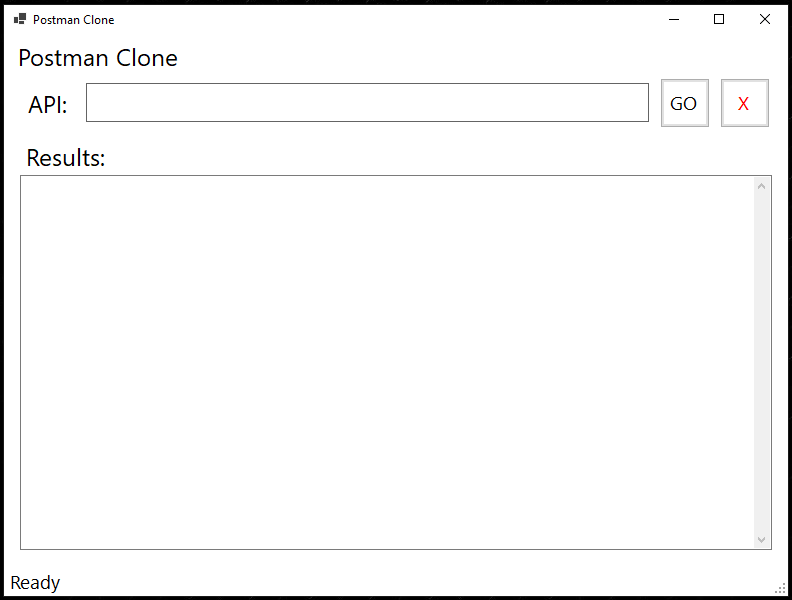
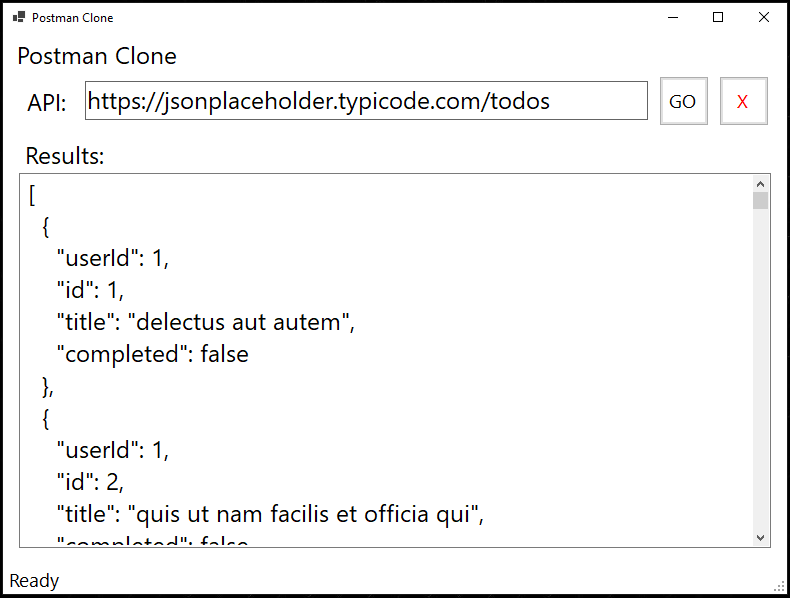

# PostmanClone

Postman Clone is a simple tool for sending GET requests to APIs and viewing responses in JSON format. Useful for testing and debugging APIs.

## Technologies used

* C#
* .NET 8
* WinForms
* HttpClient

## Using The App

1. Download the executable file from the release section.

2. When the application launches, it should look like this:

<!-- . -->

3. Fill in your API URL and hit Go:

4. Hire me. ))

## Upcoming Changes

* Adding POST, PUT, PATCH, and DELETE functionality
* Adding API headers
* Handling API authentication
* Adding Dependency Injection
* Adding Logging
* Create a web-based user interface for the application
